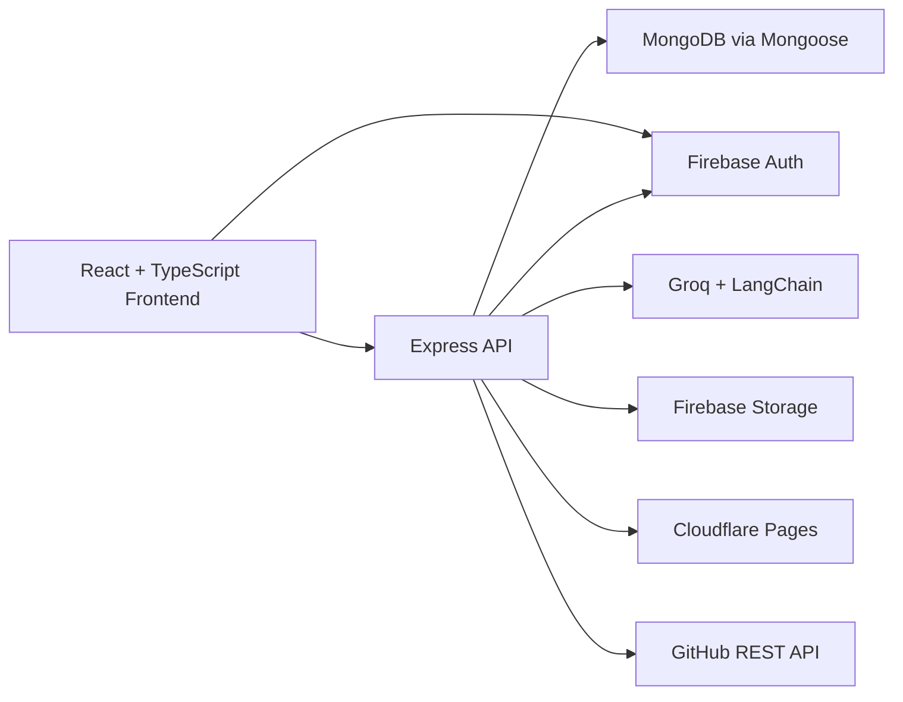
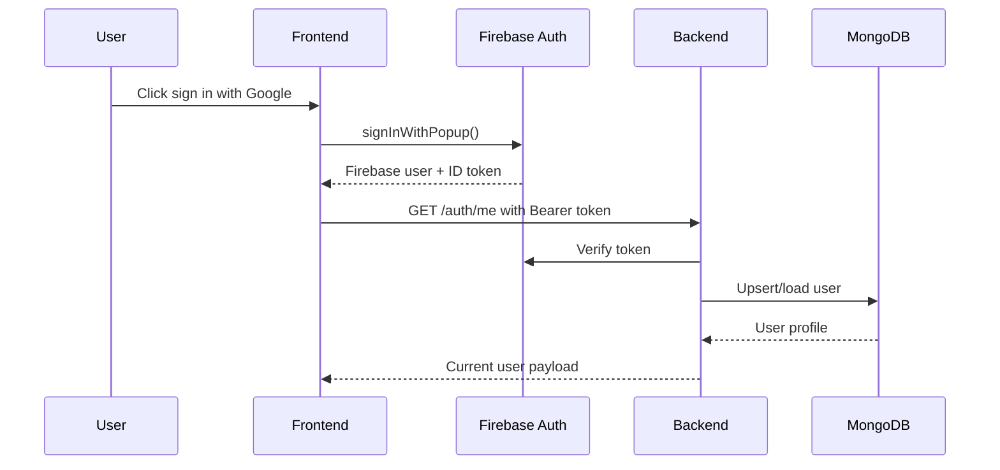
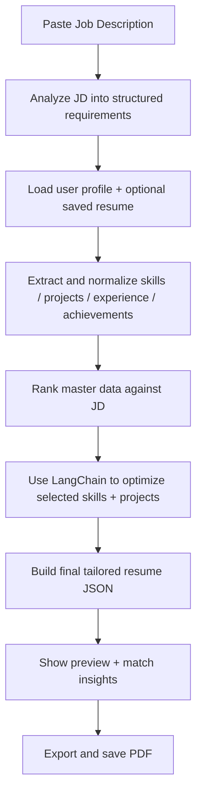
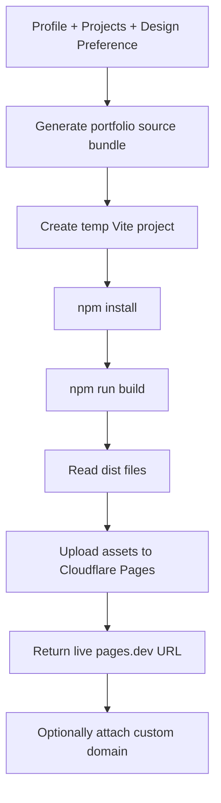

# BuildMyResume: Full Approach, Tech Stack, Techniques, and Workflow

## 1. Project Overview

BuildMyResume is a full-stack career platform built around one core idea:

**store profile data once, then reuse it everywhere.**

Instead of treating resume building, JD tailoring, and portfolio publishing as separate tools, the application keeps one structured user profile and lets that profile power:

- resume creation,
- AI-assisted content generation,
- job-description-based resume tailoring,
- resume storage and retrieval,
- portfolio website generation,
- portfolio deployment,
- and portfolio source export to GitHub.

This makes the product closer to a personal career workspace than a basic resume editor.

## 2. Product Approach From Start to End

The implementation follows a profile-first architecture:

1. Authenticate the user with Google through Firebase.
2. Sync the authenticated user into MongoDB.
3. Let the user build a structured master profile in Settings.
4. Let the user add project entries manually or import them from README files.
5. Reuse the same master data to build a clean one-page Jake resume.
6. Reuse the same master data again to tailor a resume against a pasted job description using AI.
7. Reuse the same profile and project data again to generate a live portfolio website.
8. Optionally export the generated portfolio source code to GitHub.

This approach reduces duplicate work and keeps data consistent across all surfaces.

## 3. High-Level Architecture



## 4. Repository Structure

```text
BuildMyResume/
  backend/
    src/
      app.js
      index.js
      config/
      contollers/
      middlewares/
      models/
      routes/
      services/
      utils/
  frontend/
    src/
      App.tsx
      components/
      contexts/
      lib/
      pages/
      config/
      test/
  README.md
  docs/
    BUILDMYRESUME_FULL_WORKFLOW.md
```

## 5. Frontend Stack

### Core frontend technologies

- React 18
- TypeScript
- Vite
- React Router DOM
- TanStack React Query

### UI and interaction

- Tailwind CSS
- Radix UI primitives
- shadcn-style component structure
- Framer Motion
- Sonner
- lucide-react

### Forms, state, and utilities

- React local state with `useState`, `useMemo`, `useCallback`, `useEffect`
- shared `apiRequest()` wrapper for backend communication
- `zod` on the backend for request validation

### Resume rendering and export

- `jsPDF` for programmatic PDF creation
- structured preview rendering through `JakeResumePreview`

### Frontend routing

The frontend route tree is defined in `frontend/src/App.tsx`:

- `/` -> landing page
- `/dashboard` -> authenticated dashboard shell
- `/dashboard/resumes` -> resume builder and resume library
- `/dashboard/projects` -> project CRUD
- `/dashboard/tailor` -> AI tailor flow
- `/dashboard/portfolios` -> portfolio generation and deployment
- `/dashboard/settings` -> master profile editor

## 6. Backend Stack

### Core backend technologies

- Node.js
- Express 5
- MongoDB
- Mongoose

### Security and middleware

- `helmet`
- `cors`
- `compression`
- `cookie-parser`
- `express-rate-limit`
- `morgan`

### File and content processing

- `multer` for uploads
- `mammoth` for DOCX extraction
- `pdf-parse` for PDF text extraction
- `tesseract.js` for OCR on image resumes

### AI and orchestration

- Groq SDK
- LangChain
- `@langchain/groq`
- `@langchain/core`

### External integrations

- Firebase Authentication
- Firebase Admin token verification
- Firebase Storage for resume files
- Cloudflare Pages for portfolio deployment
- GitHub REST API for source export

## 7. Main External Services Used

### Firebase

Used for:

- Google sign-in on the frontend
- ID token generation
- backend token verification
- resume file storage
- signed resume download URLs

### MongoDB

Used for:

- user master profile storage
- resume metadata storage
- project storage
- portfolio record storage

### Groq

Used for:

- ATS-style bullet generation
- profile summary generation
- project bullet expansion
- older resume tailoring generation path

### LangChain

Used for:

- structured JD analysis
- structured optimization of skills and project selection
- forcing predictable JSON outputs for AI workflows

### Cloudflare Pages

Used for:

- deploying generated portfolio build artifacts
- returning a shareable `pages.dev` URL
- attaching optional custom domains

### GitHub

Used for:

- pushing generated portfolio source files into a repo
- optionally creating the target repository

## 8. Core Domain Models

### User

The `User` model is the main source of truth. It stores:

- Firebase identity
- display name, email, phone, photo
- about/summary
- custom domain
- LinkedIn, GitHub, LeetCode, GeeksForGeeks
- education entries
- skill buckets and skill sections
- experience entries
- achievement entries
- optional Vercel connection info

### Project

Each project stores:

- title
- description
- stack
- date
- GitHub URL
- demo URL
- source type: `manual` or `readme`

### Resume

Each resume stores:

- owner
- title
- format
- section count
- extracted content text
- uploaded file metadata
- Firebase Storage path and bucket

### Portfolio

Each portfolio record stores:

- owning user
- generated project name for Cloudflare Pages
- live URL
- serialized design preference
- custom domain
- published timestamp

## 9. Important Engineering Techniques

### 9.1 Profile-first data modeling

The application does not make resume text the master source. Instead, it stores normalized structured data first and generates artifacts from that data later.

Benefits:

- less duplication,
- easier AI grounding,
- easier editing,
- cleaner portfolio generation,
- and reusable project/skill/experience data.

### 9.2 Data normalization through helper classes

Backend classes in `backend/src/classes/profile.classes.js` normalize:

- trimming,
- deduplication,
- stack parsing,
- skill bucketing,
- empty row filtering.

This keeps payloads clean before they reach MongoDB.

### 9.3 Schema validation with Zod

Every important mutation path validates input before writing:

- profile updates,
- project creation,
- resume creation,
- AI endpoints,
- GitHub export requests.

This reduces invalid state and makes the API safer.

### 9.4 Token-based auth instead of password management

The frontend signs in with Firebase, then sends a Firebase ID token to the backend. The backend verifies the token and uses the verified identity to scope all reads and writes.

This avoids building a custom password system and keeps access control simpler.

### 9.5 Structured AI instead of unbounded chat output

AI is used as a transformation layer, not as a freeform chatbot.

Examples:

- JD analysis returns structured requirement fields.
- skill and project optimization returns structured JSON.
- description generation returns exactly a requested number of lines.
- project bullet expansion returns a single cleaned bullet.

This is important for resume reliability.

### 9.6 Grounded AI prompts

The prompts explicitly tell the model to:

- avoid fabricating metrics,
- avoid inventing tools,
- stay within provided context,
- keep bullets resume-friendly,
- preserve real project IDs and links.

This improves trust and consistency.

### 9.7 Client-side PDF generation

The resume PDF is generated on the frontend with `jsPDF`.

Why this approach works well here:

- the resume layout is highly controlled,
- the app avoids a server-side PDF service,
- the export stays fast for the user,
- the frontend can preview and export from the same structured data.

### 9.8 Generated-source deployment for portfolios

The portfolio system does not just render HTML in memory. It:

1. generates a small Vite/React project,
2. writes it into a temp workspace,
3. runs `npm install`,
4. runs `npm run build`,
5. reads the `dist` files,
6. uploads those assets to Cloudflare Pages.

This gives the user a real static site build, not only a mock preview.

## 10. End-to-End User Workflow

## 10.1 Authentication Workflow



Implementation details:

- Frontend auth state lives in `frontend/src/contexts/auth-context.tsx`.
- Firebase client config lives in `frontend/src/lib/firebase.ts`.
- Backend verification is handled by `verifyFirebaseToken`.
- User sync is handled by `upsertUserFromFirebase`.

## 10.2 Settings / Master Profile Workflow

This is the most important workflow in the product because it builds the source data used everywhere else.

The Settings page lets the user manage:

- personal info,
- profile summary,
- custom domain,
- social links,
- education,
- skill sections,
- work experience,
- achievements.

Important techniques used:

- state is hydrated from backend user data,
- a baseline snapshot is kept to detect unsaved changes,
- skill buckets can be derived from skill sections,
- AI can generate summary text and bullet points,
- data is normalized before save.

Runtime flow:

1. Frontend loads `/auth/me`.
2. User edits structured fields.
3. Optional AI helpers call:
   - `/ai/profile-summary`
   - `/ai/description-bullets`
4. Frontend sends `PATCH /auth/me`.
5. Backend validates, normalizes, and persists the profile.
6. Updated profile becomes the new source of truth.

## 10.3 Projects Workflow

The Projects module adds reusable project entries that can later appear in resumes and portfolios.

Supported creation paths:

- manual project creation,
- README import.

### Manual path

The user fills:

- title,
- description,
- stack,
- date,
- GitHub URL,
- demo URL.

The backend validates the payload and writes a `Project` document.

### README import path

The user uploads a README file. The backend:

1. reads the uploaded markdown,
2. extracts the title,
3. extracts the first useful description paragraph,
4. tries to locate a tech stack section,
5. extracts URLs,
6. stores the result as a project with source `readme`.

This is a smart onboarding shortcut for users who already have GitHub projects.

## 10.4 Resume Builder Workflow

The `Resumes` page serves two purposes:

- it lists saved resumes,
- and it provides the Jake resume builder flow.

### Builder flow

The builder steps are:

1. basic contact
2. professional summary when needed
3. education
4. experience
5. achievements
6. technical skills
7. projects
8. preview and save

### Data strategy

The builder seeds itself from:

- backend user profile data,
- saved projects.

That means users do not have to rewrite everything from scratch each time.

### AI support inside the builder

The builder uses the reusable `AIDescriptionGeneratorDialog` to generate:

- experience bullets,
- achievement bullets,
- project bullets.

The prompts come from `frontend/src/config/aiPromptPresets.ts` and are designed to be ATS-oriented.

### Preview strategy

The preview is rendered through `JakeResumePreview`, which keeps:

- standardized section ordering,
- strong headings,
- one-page style structure,
- predictable typography,
- structured bullet output.

### Save strategy

When the user saves:

1. frontend converts the structured resume into a PDF blob using `jsPDF`,
2. frontend sends `FormData` to `POST /resumes`,
3. backend uploads the file to Firebase Storage,
4. backend stores metadata in MongoDB,
5. backend returns resume metadata and a signed read URL.

### Resume retrieval workflow

When listing resumes:

1. backend fetches user resumes from MongoDB,
2. backend resolves Firebase Storage locations,
3. backend generates signed temporary URLs,
4. frontend displays embedded preview when possible.

## 10.5 Resume Extraction Workflow

Resume extraction is important for AI tailoring and content recovery.

The extraction service supports:

- plain text files,
- PDF files,
- DOCX files,
- images through OCR.

The extraction order is:

1. use existing stored `content` if it already exists,
2. otherwise resolve the file from Firebase Storage,
3. infer file type,
4. parse the file using the correct parser,
5. extract focused sections like skills, projects, achievements, and experience.

This makes the tailor flow work even when the stored resume is a file rather than pure text.

## 10.6 AI Tailor Workflow

This is the most advanced logic in the product.

The tailor module is not a simple “rewrite my resume” prompt. It is a multi-stage AI pipeline.

### Full pipeline



### Stage 1: JD analysis

The backend extracts:

- primary tech stack,
- secondary skills,
- core responsibilities,
- ATS keywords,
- role title,
- seniority.

This is done by LangChain with structured output validation.

### Stage 2: master data matching

The system then compares the job requirements against the user’s:

- skills,
- projects,
- experience,
- achievements.

This is more grounded than asking an LLM to invent a whole resume from scratch.

### Stage 3: optimization

LangChain then transforms the selected data into:

- ordered optimized skills,
- selected projects with cleaned bullets,
- summary notes.

### Stage 4: insight generation

The backend computes helpful feedback like:

- current match percentage,
- projected tailored match percentage,
- missing skills,
- project upgrade suggestions,
- gap summary notes.

### Stage 5: final preview and save

The frontend converts the tailored JSON into the same resume preview model and lets the user save the final PDF to the resume library.

## 10.7 Portfolio Publish Workflow

The portfolio feature is another example of profile reuse.

The user chooses:

- theme,
- font,
- animation level,
- accent color,
- optional notes.

### Publish pipeline



### Internal backend steps

1. Load user and projects.
2. Create or reuse a `Portfolio` record.
3. Convert user data into a profile payload.
4. Generate CSS and component files for a Vite/React portfolio project.
5. Build the generated project inside a temp workspace.
6. Upload build artifacts to Cloudflare Pages.
7. Persist the final URL and preferences.

### Why this design is strong

Because the output is a real generated codebase:

- deployment is reproducible,
- source export becomes easy,
- the user can own the generated frontend,
- design preferences can be reapplied consistently.

## 10.8 GitHub Export Workflow

After generating the portfolio source bundle, the user can export that generated source to GitHub.

The user provides:

- GitHub personal access token,
- repo owner,
- repo name,
- branch,
- optional subfolder path,
- visibility.

The backend then:

1. validates the payload,
2. generates the portfolio source bundle,
3. checks if the repo exists,
4. creates it if allowed,
5. uploads each file through the GitHub Contents API,
6. returns repo metadata and update counts.

This gives the user code ownership in addition to the deployed portfolio URL.

## 11. Current API Surface

### Auth

- `POST /api/v1/auth/firebase/sign-in`
- `GET /api/v1/auth/me`
- `PATCH /api/v1/auth/me`

### AI

- `POST /api/v1/ai/tailor`
- `POST /api/v1/ai/project-bullet/extend`
- `POST /api/v1/ai/profile-summary`
- `POST /api/v1/ai/description-bullets`
- `POST /api/v1/ai/analyze-jd`
- `POST /api/v1/ai/match-master-data`
- `POST /api/v1/ai/tailor-two-stage`

### Resumes

- `GET /api/v1/resumes`
- `GET /api/v1/resumes/:resumeId/file`
- `POST /api/v1/resumes`
- `DELETE /api/v1/resumes/:resumeId`

### Dashboard

- `GET /api/v1/dashboard/summary`
- `GET /api/v1/dashboard/profile`

### Projects

- `GET /api/v1/projects`
- `POST /api/v1/projects`
- `PATCH /api/v1/projects/:projectId`
- `DELETE /api/v1/projects/:projectId`
- `POST /api/v1/projects/from-readme`

### Portfolio

- `POST /portfolio/publish`
- `POST /portfolio/github`

## 12. Setup and Environment Requirements

### Frontend environment

The frontend expects Firebase client variables such as:

- `VITE_FIREBASE_API_KEY`
- `VITE_FIREBASE_AUTH_DOMAIN`
- `VITE_FIREBASE_PROJECT_ID`
- `VITE_FIREBASE_STORAGE_BUCKET`
- `VITE_FIREBASE_MESSAGING_SENDER_ID`
- `VITE_FIREBASE_APP_ID`
- `VITE_FIREBASE_MEASUREMENT_ID`
- `VITE_API_URL`

### Backend environment

The backend requires:

- `PORT`
- `API_PREFIX`
- `CORS_ORIGIN`
- `MONGODB_URI`
- `FIREBASE_PROJECT_ID`
- Firebase Admin credentials
- `FIREBASE_API_KEY`
- `FIREBASE_STORAGE_BUCKET`
- `GROQ_API_KEY`
- optional `CF_ACCOUNT_ID`
- optional `CF_API_TOKEN`

### Why environment validation matters

The backend validates environment configuration at startup using `zod`, so configuration problems fail early instead of breaking at runtime later.

## 13. Local Development Workflow

### Frontend

```bash
cd frontend
npm install
npm run dev
```

### Backend

```bash
cd backend
npm install
npm run dev
```

### Typical local dev flow

1. Start MongoDB and configure env vars.
2. Start backend on port `8000` by default.
3. Start frontend with Vite.
4. Sign in through Firebase.
5. Build out the profile in Settings.
6. Add projects.
7. Test resume generation, tailoring, and portfolio publish flows.

## 14. Testing and Quality Tooling

### Frontend tooling present

- Vitest
- Testing Library
- jsdom
- ESLint
- Playwright dependency

### Backend tooling present

- Vitest
- Supertest

### Practical quality strategies already used in the code

- input validation with `zod`
- normalized domain classes
- guarded error handling with `ApiError`
- centralized async wrapper middleware
- structured service separation

## 15. Architectural Strengths

The strongest parts of the current design are:

- one master profile reused across every feature,
- clear separation of frontend, backend, service, and model concerns,
- grounded AI instead of purely freeform generation,
- deployable portfolio output rather than a fake preview,
- support for both live deployment and GitHub ownership,
- flexible MongoDB document modeling for nested resume data.

## 16. Current Limitations and Improvement Opportunities

Based on the current codebase, the main next-step improvements would be:

- stronger automated tests around AI response shaping and portfolio generation,
- richer resume analytics and ATS scoring visibility inside the UI,
- better resume version comparison history,
- more portfolio templates and layout systems,
- broader content import options beyond README and resume files,
- deeper usage of React Query for data fetching and cache invalidation.

## 17. Final Summary

BuildMyResume is built with a clear product and engineering strategy:

- keep one structured source of truth,
- use AI only where it adds controlled value,
- turn that data into resumes, tailored variants, and portfolio sites,
- and connect the workflow to real deployment and GitHub ownership.

From a system-design perspective, the website is not just a CRUD dashboard. It is a profile-driven content pipeline powered by React, Express, MongoDB, Firebase, Groq, LangChain, Cloudflare Pages, and GitHub, with structured validation and reusable data models at every major stage.
